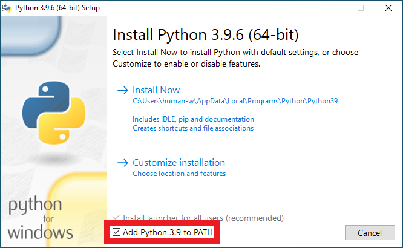
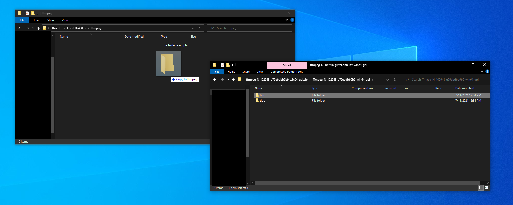
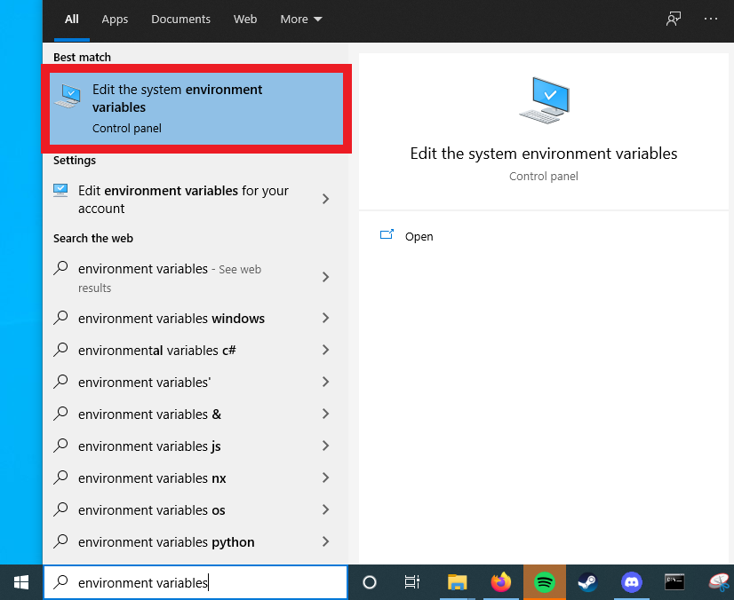
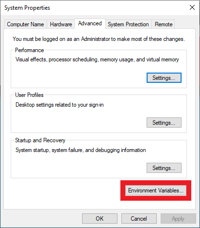
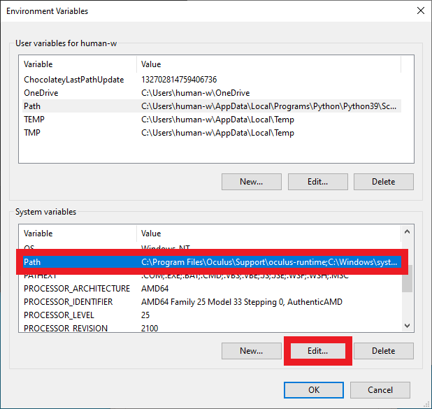
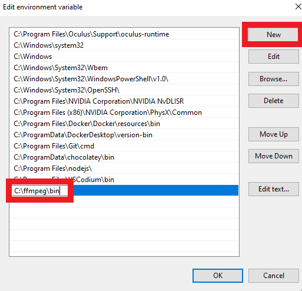

# Install on Windows

* Download python **and add it to path**
  * [Download python](https://www.python.org/downloads/)
  * 
* Install python dependencies
  *  `curl -OL https://raw.githubusercontent.com/Matamata-Animator/Matamata-Core/main/requirements.txt`
  * `pip install -r requirements.txt`
* Download ffmpeg
  * Download the latest `win64-gpl.zip` from [BtbN/FFmpeg-Builds](https://github.com/BtbN/FFmpeg-Builds/releases)
  * Create a folder `C:\ffmpeg\`
  * Drag `bin` from the downloaded zip into the folder you just created
  * 
* Add ffmpeg to path
  * Open environment variables settings
  * 
  * 
  * Open path menu
  * 
  * Add `C:\ffmpeg\bin` 

